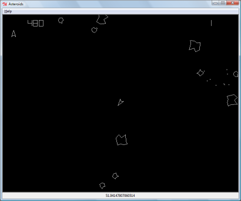
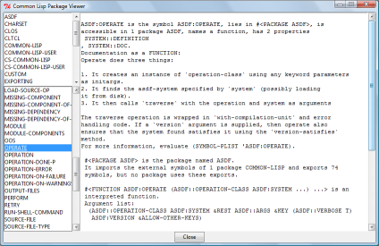
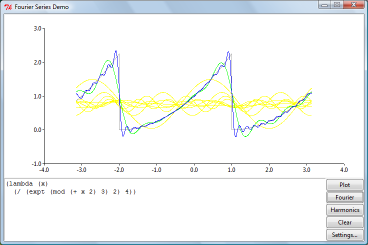
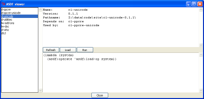

Asteroids
---------

The [Asteroids](samples/asteroids.lisp) example
demonstrates how Tcl code is embedded in Common Lisp.

  

Common Lisp Package Viewer
--------------------------

The [Common Lisp Package Viewer](samples/package-viewer.lisp) shows
how to use the basic functionalily of clTcl.

  

Fourier Series Demo
-------------------
	
The [Fourier series](samples/fourier.lisp) example demonstrates
graphics. It uses [PlotChart][plotchart] to display harmonics of the
Fourier series.

  

You need PlotChart. The [binaries from the installation
page](installation.html#binaries) have PlotChart already in them.

[plotchart]: http://tcllib.sourceforge.net/doc/plotchart.html

ASDF Viewer
-----------

The [ASDF viewer](samples/asdf-viewer.lisp) is a more elaborate
example. Shows various ways to call Tcl/Tk or post events and handle
errors.

  

Only works for SBCL and LispWorks but porting to other Lisps with
multiprocessing capabilities should not be difficult.
