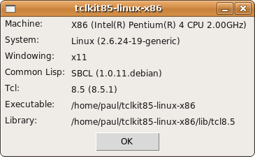

Requirements
------------

The package does not depend on any other package.
 
No particular requirements for the Tcl/Tk interpreter exist.

The clTcl package is currently ported to CLISP, Lucid, Allegro, SBCL,
CMU, Clozure CL and LispWorks, and should be easily ported to other
Common Lisp implementations as well. The only implementation dependent
part is starting the interpreter and setting up a two way stream to
it. See function [open-Tcl/Tk-stream][open] for details.

[open]: dictionary.html#open-tcl/tk-stream

Installing clTcl
----------------

You have to install the clTcl package, get a Tcl/Tk interpreter and
tell the clTcl package were the interpreter is located. On a lot of
systems the Wish interpreter is already installed in /usr/bin/wish but
even in that case you might want to choose a different one.

You can download the package from GitHub. It contains all sources, an
ASDF system definition file and an alternative system definition file
that works for example for LispWorks. Just extract the sources from
the archive and load the system in your own prefered way.

Connecting to an interpreter
----------------------------

Use keyword :interpreter to connect to an interpreter. For example
      
    (cltcl:event-loop
      #TCL[button .b -text Exit -command exit
           pack .b]
      :interpreter "/home/paul/.my-runtimes/tclkit85-linux-x86")
      
or change the default interpreter by setting
[\*interpreter\*][interpreter]
      
    (setf cltcl:*interpreter* "/home/paul/.my-runtimes/tclkit85-linux-x86")
      
Argument :interpreter eventually gets passed to
[open-Tcl/Tk-stream][open]. The exact meaning of this keyword is
implementation dependent but the general idea is that :interpreter
points to the executable of the interpreter. Keyword :options is
available for command line options.

The default value for the :interpreter keyword is
[\*interpreter\*][interpreter] and its default value is /usr/bin/wish.

[interpreter]: dictionary.html#*interpreter*
[open]: dictionary.html#open-tcl/tk-stream

Choosing a Tcl/Tk interpreter
-----------------------------

Tcl/Tk is available for many systems in many forms. Visit the [Tcl
Developer Xchange software page][download] for an overview. Popular
binaries are [ActiveState's ActiveTcl distribution][activetcl].

### System Install
 
A Tcl/Tk interpreter can be installed system wide. On Unixy systems it
is often installed. Type `wish` on the command line to test if it is
available.

If a Wish (or any other) interpreter is pre-installed you can simply
connect to it as explained in the previous section. If it installed as
/usr/bin/wish, which is clTcl's default, it even works out of the box.
    
If Wish is not pre-installed you can download
[ActiveTcl][activetcl]. You can for example install Wish 8.5 for
Windows and connect to it with :interpreter "wish85"

 
### Standalone Executable

An interpreter can also be run as standalone executable. The advantage
is that you have full control over the Tcl/Tk version your application
uses. Your application is unaffected when the system installed
interpreter changes. It is also ideal for deployment
 
Download [ActiveTcl][activetcl] and follow instructions on these pages
to choose an interpreter. No installation is required; just find the
interpreter executable and place it anywhere you like. Connect to it
as explained in the previous section.
     
    
[activetcl]: http://www.activestate.com/activetcl
[download]: http://www.tcl.tk/software/tcltk/

Testing you installation
------------------------

You can test you installation with non-exported function
test. Command:
      
    CL-USER> (cltcl::test :interpreter "/home/paul/tclkit85-linux-x86")
      
displayed the following dialog on my system

	

    

    
Troubleshooting
---------------

Global [\*trace-level\*][trace-level] is for
troubleshooting. Set it to 1 to see all of clTcl's communication
logged to \*trace-output\*. Set it to 2 to see more details.

Function test accepts keyword :trace-level that sets
[\*trace-level\*][trace-level] for you. Running
      
     (cltcl::test :trace-level 2)
      
is an easy way to troubleshoot installation problems.
    
    
Running test with :trace-level 1 should produce something like the
following on \*trace-output\*

      
    Handshaking...
    -> Sending handshake script
    <- Reply: Tcl/Tk at your service. Version 8.5
    Handshake okay
    Setting up Tcl/Tk side...
    -> Running script of 12 commands
    <- Incoming :reply
    Tcl/Tk side ready
    -> Running script of 3 commands
    <- Incoming :reply
    <- Incoming :event
    Calling event handler MACHINE-TYPE
    -> Sending reply
    <- Incoming :event
    Calling event handler MACHINE-VERSION
    -> Sending reply
    <- Incoming :event
    Calling event handler SOFTWARE-TYPE
    -> Sending reply
    <- Incoming :event
    Calling event handler SOFTWARE-VERSION
    -> Sending reply
    <- Incoming :event
    Calling event handler LISP-IMPLEMENTATION-TYPE
    -> Sending reply
    <- Incoming :event
    Calling event handler LISP-IMPLEMENTATION-VERSION
    -> Sending reply
    Listener signing off
   
    
If you want to see how messages are sent exactly you can trace
function [send][send].
  
[trace-level]: dictionary.html#*trace-level*
[send]: dictionary.html#send-script

